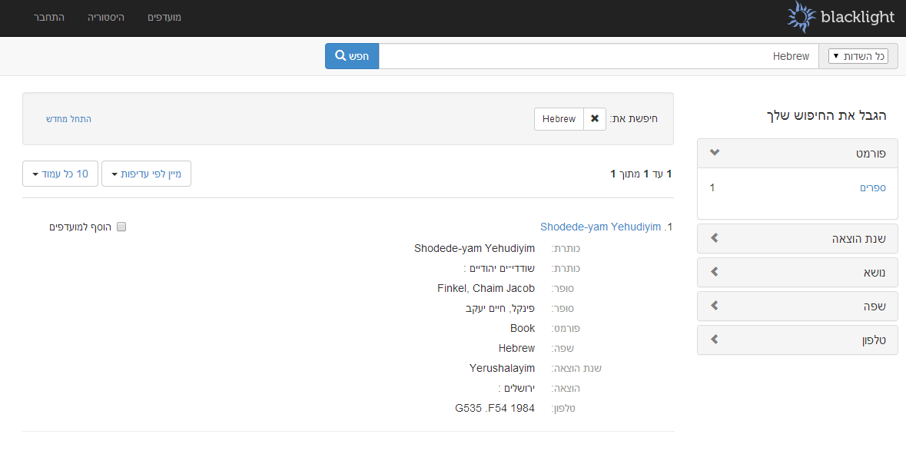

Blacklight RTL
==============
[](http://badge.fury.io/rb/blacklight_rtl)

Right to Left Layout for [Blacklight 5.x](https://github.com/projectblacklight/blacklight/ "Project Blacklight").



Installation
------------

Add Blacklight RTL to your `Gemfile`:

```ruby
gem "blacklight_rtl"
```

Run bundle install to download the latest version:

```ruby
bundle install
```

Change the default import statment in `blacklight.css.scss` to:

```ruby
@import 'blacklight_rtl/blacklight_rtl';
```

Localization
------------

You can change the default language to Hebrew, just add `config.i18n.default_locale = :heb` to `application.rb`.

Affected Files
--------------

This gem overwrite few base view files to change the overall layout to RTL.

Here is the affected files:

  * `/app/views/bookmarks/index.html.erb`
  * `/app/views/search_history/index.html.erb`
  * `/app/views/_user_util_links.html.erb`
  * `/app/views/catalog/_constraints.html.erb`
  * `/app/views/catalog/_facet_pagination.html.erb`
  * `/app/views/catalog/_index_header_default.html.erb`
  * `/app/views/catalog/_previous_next_doc.html.erb`
  * `/app/views/catalog/_sort_and_per_page.html.erb`

TODO
----

  * Translate tools and login sections.
  * Create variables for CSS configuration and expose them to the root appplication.
